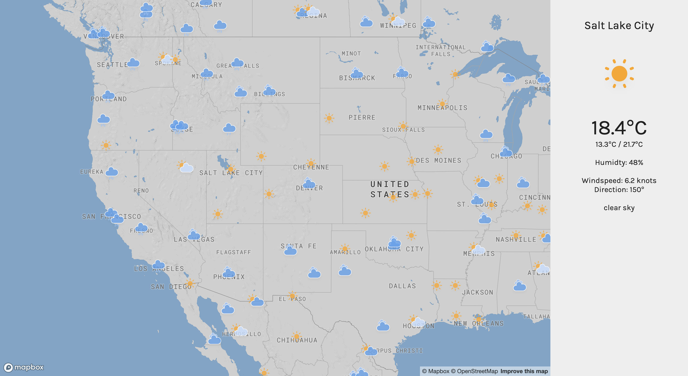
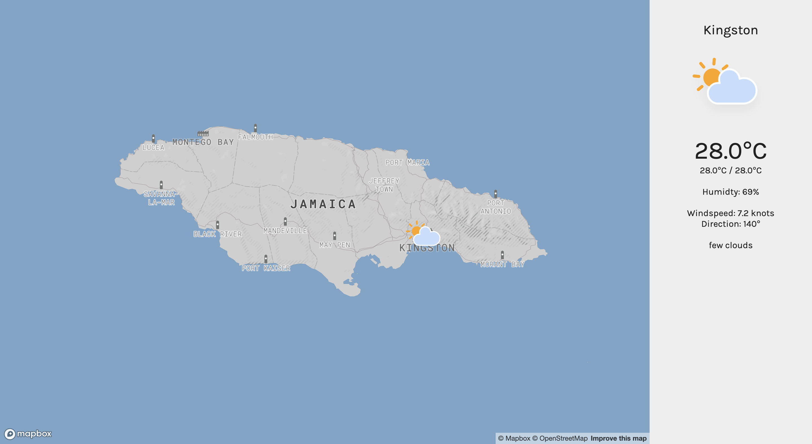

# **It's the Weather!**
## Project 2 : Web Development Immersive, General Assembly 

Live link: http://www.orjon.com/weather/<br>
GitHub: https://github.com/orjon/weather

## Overview
It's the Weather! Interactive World map that shows current weather conditions.

React.js application that makes use of OpenWeatherMap and Mapbox APIs to gather current global weather information and place appropriate weather icons on an interactive world map. Icons can be selected to show more detailed weather information at that location.


This was my second project completed whilst undertaking the Web Development Immersive course at General Assembly, London. It was a pair project completed in 2 days with fellow student [Pascual Vila](https://www.linkedin.com/in/pascual-vila-web-developer/).


## Brief

* Build a React application that consumes a public API.


## Technologies Used

* React.js
* Axios
* jQuery
* [OpenWeatherMap API]('https://openweathermap.org/api')
* [Mapbox API]('https://docs.mapbox.com/api/')
* Yarn

## Approach Taken

### Screen Layout
The application is divided into two sections. The interactive World map in the left hand side, and the information panel on the right.



The application is similarly split into two react components; [map.js](src/components/map.js) & [sidepanel.js](src/components/sidepanel.js)

The game is divided into two views; the title page and the game page.

The title page shows the game title/logo and a gently pulsing keyboard graphics highlighting the keys used to control the game. Pressing any key takes the player to the game page and starts the game. The page is laid out using Sass and Flexbox. The logo and keyboard graphics are png image with animated opacity applied the keyboard to create the pulsing effect.




The game page shows the 10x20 game grid overlaid on the logo. In the bottom left the game controls “X M S P” are shown and the bottom right shows the player’s score and an email link to the author.


### Grid & Blocks
The grid squares are numbered from left to right and top to bottom, so that each square is ten more than the square directly above it. Above the 20 rows of visible grid squares, there are four invisible rows used to stage the blocks before they fall into view. When a grid square is occupied, its background colour takes on that of the occupying block - giving the impression of the block sitting on the grid.

Each block consists of four squares and has an allocated colour. Blocks are randomly generated in one of seven predefined configurations - the same as in the original Tetris game. The blocks are represented in code as an array of four values corresponding to the numbers of the grid squares occupied by each square in the block.


Blocks fall, one at a time, from the top of the grid until they come to rest at the bottom, or are obstructed from falling further by another block. Once a block has come to rest, it’s array of occupied grid squares is added to an array of all grid squares currently occupied by a non-moving block. Every move and rotate of a falling block is first checked against this array to make sure the move is valid.

To make a block fall one row, ten is added to the value of each square within it.
```Javascript
fall(){
  this.shapePrevious = this.shape.slice()
  for (let i=0; i<this.shape.length; i++) { //loop through each shape pixel
    this.shape[i] += 10 //every pixel below
  }
  this.drawTetri()
}
```

To rotate a block, a rotation matrix is applied to the block’s array. The rotation matrices are unique for each block configuration

```Javascript
rotate(){
  this.rotation += 90
  let rotationMatrix = []
  if (this.rotation === 360) this.rotation = 0
  switch (this.rotation) {
    case 0:
      rotationMatrix = [0,0,-9,0]
      break
    case 90:
      rotationMatrix = [11,0,0,0]
      break
    case 180:
      rotationMatrix = [-11,20,0,0]
      break
    case 270:
      rotationMatrix = [0,-20,9,0]
      break
  }
  if (canRotate(this.shape, rotationMatrix)) {
    for (let i=0; i<this.shape.length; i++) {
      this.shape[i] += rotationMatrix[i]
    }
  } else {
    this.rotation -= 90
    if (this.rotation === -90) this.rotation = 270
  }
}
```

### Controls

The player controls the falling block using the arrow keys for directional movement and the space bar to rotate each block 90º clockwise. Any movement is only permissible of the destination gird squares are not already occupied. Blocks cannot move off the sides of the grid. Other games controls are:

* X - Exit game
* M - Toggle music
* S - Toggle sound effects
* P - Pause game
* *G - Toggle game grid ('hidden' expert mode!)*


### Scoring & Game Speed
Points are scored for each block placed and each line cleared. Additional points are given for clearing multiple horizontal lines together. A point is deducted for every avoidable collision.


| Completed move  | Points        |
| --------------- |:-------------:|
| Block placed    | 10 |
| Sideways collision| -1 |
| 1 line cleared  | 100      |
| 2 lines cleared | 250      |
| 3 lines cleared | 500      |  
| 4 lines cleared | 1000      |

The rate at which the blocks fall increases by 50ms with every 500 points scored.

### Game Flow

The game flow below represents the typical logic in a single clock tick.


### Music & Sound Effects
Music and sound effects are important elements to a computer game. Music helps set the tone of the game and sound effects provide feedback assisting the gameplay.

The background music was commissioned to be simple and catchy, yet not too repetitive to get annoying during long games. It is 32 seconds long and loops infinitely.


A nudge sound is triggered as a block is moved in any direction and a ratchet type sound is played with each block rotation. For attempted moves that cannot be completed due to obstruction a bump noise is played. Four different sounds are played when 1, 2, 3 or 4 lines are cleared.


*The music and sound effects were created for the game by Joe Lewis (<joe@dojostudios.com>), [DojoStudios](http://www.joelewis.info).*

## Bugs
Some known bugs in the game:

* Long key-presses: If a key is held down the resulting block movement can be unpredictable. The sound effects also suffer from this.

* Occasionally blocks seem to appear lower than they should. I believe this is a consequence of the above mentioned long key-presses.

* Keyboard diagram on startup shows the up arrow illuminated - yet is serves no function in the game.

## Wins and Blockers
* Adding four invisible 'staging' rows to the top of the grid made block placement much simpler.

* Block rotation was difficult to resolve. Happy with my chosen matrices method.

* Logo placement happened by accident! It was initially intended to be above the grid, but when I saw the translucent block fall over it, I thought it looked perfect. This also solved the problem of what to fill the sides of the screen with.

* I'm really happy with the sound and music and Joe Lewis created for this game. Fits perfectly.

* G hidden grid 'expert mode'. I turned the gird off during some testing and found the game surprisingly difficult to play without it - so decided to add it in as a little hidden secret for those that read readme's!

* A win for me was getting very comfortable with Flexbox as I made this game. It's top-down logic is very helpful in structuring HTML.

## Possible Additions & Improvements

* The original game shows a preview of the next block to come. This would be a nice feature to add and I don't believe it would be too complicated to achieve.

* Two player mode: In theory this could be achieved my duplicated the grid ad adding control for the second player. Would be a nice feature to add.

* Persistent score keeping. I'd like to be able to add a backend log of high scores.

* I would like to generate the grid in JavaScript. I have started on this:
```JavaScript
 function createGrid() {
   let gridNumbers = 40      //starting point for visible grid
   for (let i=0; i<20; i++){ //Create 20 rows of..
     $('<div></div>').addClass('row').appendTo($gameGrid) //Divs with .row, with
   }
   for (let j=0; j<10; j++) {
     $('.row').append('<div>'+gridNumbers+'</div>') //10 Divs with gridNumbers++
     gridNumbers++
   }
   $('#gameGrid .row').children().addClass('square')
}
```
