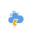

# **It's the Weather!**
## Project 2 : Web Development Immersive, General Assembly 

https://www.orjon.com/weather/

**_Update (2019-06-30): Originally this application displayed global weather data. A change in the OpenWeatherMap API now limits free weather data to 25 square degrees._**

## Overview
It's the Weather! Interactive World map that shows current weather conditions.

React.js application that makes use of OpenWeatherMap and Mapbox APIs to gather current global weather information and place appropriate weather icons on an interactive world map. Icons can be selected to show more detailed weather information at that location.


This was my second project completed whilst undertaking the Web Development Immersive course at General Assembly, London. It was a pair project completed in 2 days with fellow student [Pascual Vila](https://www.linkedin.com/in/pascual-vila-web-developer/).


## Brief

* Build a React application that consumes a public API.


## Technologies Used

* React.js
* Axios
* jQuery
* [OpenWeatherMap API]('https://openweathermap.org/api')
* [Mapbox API]('https://docs.mapbox.com/api/')
* Yarn

## Approach Taken

### Screen Layout & Components
The application is divided into two sections. The interactive World map in the left hand side, and the information panel on the right.


The application has two corresponding react components; [map.js](src/components/map.js) & [sidepanel.js](src/components/sidepanel.js)

```JavaScript
render() {
  return (
    <main>
      {this.state.weatherData &&
      <Map
        weatherPoints={this.state.weatherData}
        center={this.mapCenter}
        points={this.state.weatherData}
        handleIconClick={this.handleIconClick}
      />
      }
      <SidePanel
        location={this.state.clickedLocation}
        weatherData={this.state.weatherData}
      />
    </main>
  )
}
```

### Retrieving  Weather information
When a user starts the application it connects to OpenWeatherMap's API and retrieves the following weather information for 1204 locations:


|Field | Description |
|:----|:----|
|id|Unique location ID|
| name | Location name|
|latlng| latitude and longitude|
| temp| Current temperature|
|tempMin| Daily maximum temperature|
|tempMax|Daily minimum temperature|
|humidity| humidity %|
|windSpeed| Wind speed|
|windDirection| Wind direction deg°|
|weatherId| Weather condition ID|
|weather| Description of weather|
|weatherClouds| Cloudiness %|
|weatherIcon| Weather icon code|

This is achieved via an `axios.get(...)` request and the result is mapped into an array.

```javascript
globalWeatherInfo() {
  axios.get(`https://api.openweathermap.org/data/2.5/box/city?bbox=${this.world}${this.zoomLevel}&APPID=${openweatherToken}`)
    .then(response => {
      const tempArray = response.data.list.map(eachLocation => ({
        id: eachLocation.id,
        name: eachLocation.name,
        latlng: [eachLocation.coord.Lat, eachLocation.coord.Lon],
        temp: eachLocation.main.temp,
        tempMin: eachLocation.main.temp_min,
        tempMax: eachLocation.main.temp_max,
        humidity: eachLocation.main.humidity,
        windSpeed: eachLocation.wind.speed,
        windDirection: eachLocation.wind.deg,
        weatherId: eachLocation.weather[0].id,
        weather: eachLocation.weather[0].description,
        weatherClouds: eachLocation.clouds.today,
        weatherIcon: eachLocation.weather[0].icon
      }))
      const weatherData = [...this.state.weatherData, ...tempArray]
      this.setState({ weatherData })
    })
}
```

The returned locations are determined by `this.zoomLevel` in the API request. At the moment this value is hard-coded, but future versions will have this linked to map zoom to allow the icon density to scale appropriately.
### Weather icons

The OpenWeatherMap API provides a weather icon code. These were matched with a separately sourced set of `.svg` icons.

|description| code | day | code | night |
|:----|:----:|:----:|:----:|:------:|
|clear sky |01d| |01n| |
|few clouds |02d| |02n||
|scattered clouds |03d| |03n||
|broken clouds |04d| |04n| |
|shower rain |09d| |09n||
|rain |10d| |10n| |
|thunder storm |11d| |11n||
|snow |13d| |13n| |
|mist |50d| |50n|   |    


The appropriate icon is assigned as a custom Mapbox marker and placed on the map using it's latitude and longitude.


```javascript
setMarkers() {
  this.markers.forEach(marker => marker.remove())
  this.markers = this.props.points.map(location => {
    let icon = ''
    switch (location.weatherIcon) {
      case '01d': icon='day'
        break
        //...
        //(case for each icon code)
        //...
      case '50n': icon='cloudy'
        break
      default: icon='cloudy'
    }

    const $marker = $('', { class: 'custom-marker img', id: location.id , src: `./images/${icon}.svg`})

    $marker.on('click', () => this.props.handleIconClick(location.id))

    return new mapboxgl.Marker($marker.get(0))
      .setLngLat({  lat: location.latlng[0], lng: location.latlng[1] })
      .addTo(this.map)
  })
}
```

The icon set also has animated versions that are used in the information panel.

### Interface

The application is controlled solely by means of interacting with the map component. The map can be moved in any direction and the zoom level can be adjusted. Hovering over an icon enlarges it, and when clicked, the side panel displays detailed weather information for the selected location together with the corresponding animated weather icon.

 


## Bugs
Some known bugs in the application:

* Lag issues when moving map. I believe this is due to the number of `.svg` files that the browser has to draw, I will try using `.png` files in a future version.

## Wins and Blockers
* The time constraint for this project was challenging - but we managed to divide the work and the result is clean and functional.

* Learning how to access APIs and using online documentation to work out how to use them was very rewarding. The quantity and breadth of APIs available is also astounding.


## Possible Additions & Improvements

* On initial load  map location is hard-coded and the side panel is empty. This is less a bug, more an omission due to time constraints. A future improvement will be to centre the map on the user's the browser location, and populate the side panel with the closest weather information.

* The number of locations is currently hard-coded, but future versions will have this linked to map zoom to allow the icon density to scale appropriately.

 
